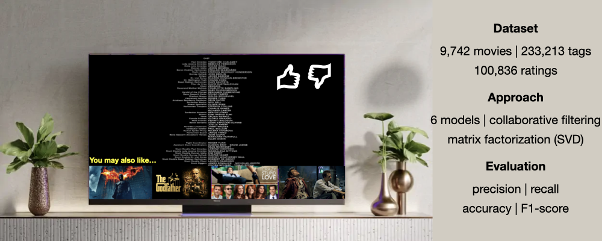

# 🎬 Movie Recommendation Systems: A Comparative Study
This project is divided in two parts and implements six recommendation system models to predict users’ movie preferences.


## 📂 Table of Contents
- [Overview](#-overview)
- [Dataset](#-dataset)
- [Problem Statement](#-problem-statement)
- [Methodology](#-methodology)
- [Results](#-results)
- [Insights & Recommendations](#-insights--recommendations)
- [Technologies Used](#technologies-used)
- [How to Run](#how-to-run)

## 🧠 Overview
This project implements six recommendation approaches: (part 1) rank-based (average ratings), user–user similarity, item–item similarity, model-based collaborative filtering (matrix factorization), (part 2) cluster-based, and content-based (TF-IDF + Cosine Similarity). In part 1, model performance is evaluated using Precision@K, Recall@K, and F₁-score, enabling the generation of personalized top-N movie recommendations; in part 2, cluster-based model performance is evaluate using RMSE, Precision, Recall, and F1 Score.

## 📊 Dataset
This dataset was originally provided as part of the **Applied Data Science Program by MIT**. The dataset in part 1 is a **100,836 × 4 CSV file**, where each row represents a user’s rating of a movie. Each record contains four features describing **which user**, **which movie**, **the rating**, and **when the rating was made**.  

| Variable   | Description                         |
|------------|-------------------------------------|
| userId     | Unique identifier for each user     |
| movieId    | Unique identifier for each movie    |
| rating     | Rating given by the user to the movie |
| timestamp  | Time when the rating was recorded   |

The dataset in part 2 is a **233,8213 × 7 DataFrame** after merging the original two CSV files. Each record contains:

- `userId`
- `movieId`
- `rating`
- `timestamp`
- `title`
- `genres`
- `tag`

## ❓ Problem Statement
Movie streaming platforms offer thousands of titles, but users often struggle to discover movies that match their preferences. Traditional word-of-mouth recommendations are limited by social connections and subjective opinions. 

The goal of this project is to **build a recommendation system** that can predict a user's movie preferences and provide **personalized top-N recommendations**. This involves implementing and comparing multiple approaches, including part 1, **rank-based methods, collaborative filtering (user-user and item-item), and model-based matrix factorization**, while evaluating their performance using metrics like **Precision@K, Recall@K, F₁-score, and RMSE**, and part 2, **cluster-based** and **content-based** modelling.

## 🔎 Methodology
The recommendation system development followed an **end-to-end workflow** from data preprocessing to model evaluation and delivery:

1. **Data Preparation**  
   - Loaded the dataset containing user–movie ratings.  
   - Performed basic exploratory data analysis to understand rating distributions, user activity, and movie popularity.  
   - Created a **user–item interaction matrix** for collaborative filtering models.

2. **Model Implementation**  
   - **Rank-based recommendation:** Predicted ratings based on average movie ratings.  
   - **User–User collaborative filtering:** Estimated ratings using similarity between users.  
   - **Item–Item collaborative filtering:** Estimated ratings using similarity between items.  
   - **Model-based collaborative filtering (SVD):** Factorized the user–item matrix to capture latent features.
   - **Clustering-Based Recommendation System:** Grouped users/items using clustering techniques.  
   - **Content-Based Recommendation System (TF-IDF + Cosine Similarity):** Applied TF-IDF vectorization, cosine similarity.  

3. **Model Evaluation**  
   - Split data into training and test sets.  
   - Evaluated models using **Precision@K, Recall@K, F₁-score, and RMSE** to measure recommendation accuracy and coverage.  

4. **Hyperparameter Optimization**  
   - Applied **grid search cross-validation** to identify optimal parameters for similarity-based and SVD models.  
   - Selected the best-performing models for generating final recommendations.

5. **Recommendation Delivery**  
   - Generated **top-N personalized movie recommendations** for each user based on predicted ratings.  
   - Optionally, ranked recommendations using **corrected ratings** that account for both predicted ratings and movie popularity.

This methodology ensures a **robust, end-to-end pipeline** for building and evaluating movie recommendation systems.

## 📈 Results

### Part 1
The recommendation models were evaluated using **Precision@K, Recall@K, F₁-score, and RMSE**. Key observations include:

1. **Rank-based Recommendation**  
   - Simple average-based predictions  
   - Achieved moderate RMSE but limited personalization  

2. **User–User Collaborative Filtering**  
   - Leveraged similarity between users to predict ratings  
   - **Highest F₁-score**, indicating the best overall recommendation performance  

3. **Item–Item Collaborative Filtering**  
   - Used item similarity for rating prediction  
   - Performed slightly lower than user-user filtering but still improved over rank-based model  

4. **Model-Based Collaborative Filtering (SVD)**  
   - Captured latent features through matrix factorization  
   - Provided balanced performance in terms of accuracy and scalability  

**Performance Metrics (Example)**

| Model                     | RMSE   | Precision@K | Recall@K | F₁-score |
|---------------------------|--------|-------------|----------|----------|
| Rank-based                | 0.98   | 0.76        | 0.54     | 0.63     |
| User–User CF              | 0.88   | 0.74        | 0.51     | 0.60     |
| Item–Item CF              | 0.95   | 0.76        | 0.55     | 0.64     |
| Model-Based CF (SVD)      | 0.94   | 0.76        | 0.55     | 0.64     |

**Key Takeaways**

- Collaborative filtering models significantly outperform rank-based recommendations.  
- User–User similarity-based CF achieved the **best F₁-score**, making it the most effective approach for this dataset.  
- Matrix factorization (SVD) provides good scalability and comparable performance, suitable for larger datasets.  
- Performance can be further improved through **hyperparameter tuning** and **hybrid recommendation strategies**.

### Part 2

Cluster-based model after hyperparameter tuning:
- **RMSE:** 0.9499  
- **Precision:** 0.715  
- **Recall:** 0.500  
- **F1 Score:** 0.588

Comparison of Approaches

| Aspect | Clustering-Based | Content-Based |
|--------|------------------|---------------|
| Uses User Behavior | ✅ | ❌ |
| Cold-Start (New User) | ❌ | ✅ |
| Thematic Interpretability | Moderate | High |
| Depends on Metadata | Low | High |
| Diversity | Higher | Lower |

## 💡 Insights & Recommendations

**Insights:**
- Collaborative filtering models (both user-user and item-item) consistently outperform rank-based methods, highlighting the importance of leveraging user or item similarities.  
- User–User collaborative filtering achieved the highest F₁-score, indicating strong alignment between predicted and actual user preferences.  
- Matrix factorization (SVD) effectively captures latent features, providing a scalable solution for large datasets with comparable performance to similarity-based methods.  
- Movies with higher rating counts tend to stabilize predictions, emphasizing the role of popularity in recommendation accuracy.  

**Recommendations:**

For dataset in part 1:
- Deploy **User–User collaborative filtering** as the primary recommendation engine for this dataset to maximize user satisfaction.  
- Consider **hybrid recommendation systems** combining collaborative filtering with rank-based or content-based methods to further improve recommendations.  
- Continuously update models with **new user ratings** to maintain accuracy and relevance over time.  
- Explore additional **hyperparameter tuning** and feature engineering (e.g., temporal trends or genre preferences) to enhance model performance.

For dataset in part 2:

- Proper preprocessing and aggregation are critical for recommendation systems.
- Interaction-level and item-level modeling require different data structures.
- Precision and RMSE alone are insufficient — recall and F1 provide deeper insight.
- Text-based feature engineering can produce meaningful similarity even without full reviews.

<a id="technologies-used"></a>
## ⚙️ Technologies Used
- **Python** – General purpose programming
- **Pandas** – Data manipulation and analysis
- **NumPy** – Numerical computations
- **Matplotlib** – Data visualization
- **Surprise** - Recommendstion System Library
- **Scikit-learn** – Machine Learning tools for metrics and evaluation
- **NLTK**

<a id="how-to-run"></a>
## ▶️ How to Run
```bash
# Clone the repository
git clone https://github.com/elescj/014-movies-lr.git
cd 014-movies-lr

# (Optional) Create a virtual environment
python -m venv venv
source venv/bin/activate  # On Windows: venv\Scripts\activate

# Install dependencies
pip install -r requirements.txt

# Run the script
python main.py
```
