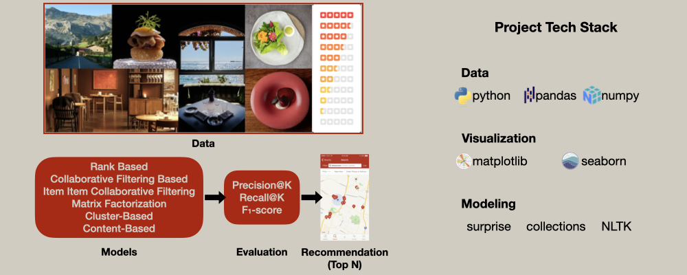

# 🍽️ Yelp Restaurant Recommendation System: A Comparative Study
A comparative study of rank-based, collaborative filtering, and clustering-based recommendation algorithms applied to Yelp restaurant review data.



---

## 📂 Table of Contents
- [Overview](#-overview)
- [Dataset](#-dataset)
- [Problem Statement](#-problem-statement)
- [Methodology](#-methodology)
- [Results](#-results)
- [Insights & Recommendations](#-insights--recommendations)
- [Technologies Used](#-technologies-used)
- [How to Run](#-how-to-run)

---

## 🧠 Overview

This project develops and compares multiple **restaurant recommendation systems** using Yelp review data.

The study is conducted in **two stages**:

**Part 1 — Collaborative Filtering Models**
- Rank-based recommendation (average ratings)
- User–User collaborative filtering
- Item–Item collaborative filtering
- Model-based collaborative filtering using **matrix factorization**

**Part 2 — Advanced Modeling with Review Data**
- Extended dataset including **review text**
- Additional **Co-Clustering collaborative filtering model**
- Further evaluation and hyperparameter tuning

Model performance is evaluated using **RMSE, Precision@K, Recall@K, and F₁-score**, enabling the generation of **personalized top-N restaurant recommendations**.

---

## 📊 Dataset

This dataset was originally provided as part of the **Yelp Dataset Challenge**.

Each row represents a **user review of a restaurant**.

### Part 1 — Ratings Dataset

| Variable | Description |
|--------|-------------|
| user_id | Unique identifier for each user |
| business_id | Unique identifier for each restaurant |
| stars | Rating given by the user (1–5 scale) |

### Part 2 — Extended Dataset with Reviews

| Variable | Description |
|--------|-------------|
| user_id | Unique identifier for each user |
| business_id | Unique identifier for each restaurant |
| business_name | Name of the restaurant |
| stars | Rating given by the user |
| text | Written review from the user |

**Dataset statistics**

- **229,907 reviews**
- **45,981 users**
- **11,537 restaurants**

> **Note:** The original dataset exceeds GitHub's upload limit.  
> To access the data, please contact me via my portfolio website:  
> [Contact Charles Jiao](https://charles-jiao.netlify.app/contact)

---

## ❓ Problem Statement

Restaurant discovery platforms list thousands of dining options, making it challenging for users to find restaurants that match their tastes and preferences.

Traditional recommendation methods such as word-of-mouth or browsing reviews are often inefficient and subjective.

The goal of this project is to **build a recommendation system** that can predict a user’s restaurant preferences and generate **personalized top-N restaurant recommendations**.

To achieve this, the project compares multiple recommendation strategies including:

- **Rank-based methods**
- **User–User collaborative filtering**
- **Item–Item collaborative filtering**
- **Matrix factorization**
- **Co-Clustering collaborative filtering**

Model performance is evaluated using **RMSE, Precision@K, Recall@K, and F₁-score**.

---

## 🔎 Methodology

The recommendation system development followed an **end-to-end workflow** from data preparation to model evaluation and delivery.

### 1. Data Preparation
- Loaded Yelp review datasets
- Performed exploratory data analysis on:
  - rating distributions
  - user activity
  - restaurant popularity
- Filtered sparse users and restaurants to reduce noise
- Created a **user–item interaction matrix**

### 2. Model Implementation

Multiple recommendation models were implemented:

**Baseline Model**
- Rank-based recommendation using average ratings

**Similarity-Based Models**
- User–User collaborative filtering
- Item–Item collaborative filtering

**Latent Factor Model**
- Matrix Factorization (SVD)

**Advanced Model (Part 2)**
- Co-Clustering collaborative filtering

### 3. Model Evaluation

Models were evaluated using:

- **RMSE** — prediction accuracy
- **Precision@K** — relevance of recommendations
- **Recall@K** — coverage of relevant items
- **F₁-score** — balance between precision and recall

### 4. Hyperparameter Optimization

Grid search cross-validation was used to optimize model parameters for:

- similarity-based models
- matrix factorization
- co-clustering algorithm

### 5. Recommendation Delivery

Final models generate **Top-N personalized restaurant recommendations** for each user.

Recommendations can also be ranked using **corrected ratings** that adjust predictions by rating popularity.

---

## 📈 Results

### Part 1 — Collaborative Filtering

| Model | RMSE | Precision@K | Recall@K | F₁ |
|------|------|------|------|------|
| Rank-based | 0.98 | 0.76 | 0.54 | 0.63 |
| User–User CF | 0.88 | 0.74 | 0.51 | 0.60 |
| Item–Item CF | 0.95 | 0.76 | 0.55 | 0.64 |
| Matrix Factorization | 0.94 | 0.76 | 0.55 | 0.64 |

### Part 2 — Co-Clustering Model

| Model | RMSE | Precision | Recall | F₁ |
|------|------|------|------|------|
| Co-Clustering | **1.037** | **0.764** | **0.404** | **0.529** |

**Observations**

- Co-Clustering produces **high precision but lower recall**.
- The model tends to recommend **high-confidence items** but misses some relevant ones.
- Hyperparameter tuning produced **minor improvements**.

---

## 💡 Insights & Recommendations

### Insights

- Collaborative filtering models outperform simple rank-based recommendations.
- User–User similarity-based filtering produced strong personalized recommendations.
- Matrix factorization offers **good scalability** for large recommendation systems.
- Co-Clustering provides **high precision but limited recall**, making it suitable when recommendation accuracy is prioritized over coverage.
- Restaurants with higher review counts produce **more stable predictions**.

### Recommendations

- Deploy **User–User collaborative filtering** as the primary recommendation model.
- Use **rank-based recommendations** to address **cold-start users**.
- Explore **hybrid recommendation systems** combining collaborative filtering with **review text features**.
- Incorporate **restaurant metadata (location, cuisine, categories)** to further improve recommendations.

---

## ⚙️ Technologies Used

- **Python**
- **Pandas**
- **NumPy**
- **Matplotlib**
- **Seaborn**
- **Surprise (Recommendation System Library)**
- **Scikit-learn**

---

## ▶️ How to Run

```bash
# Clone the repository
git clone https://github.com/elescj/015-yelp-lr.git
cd 015-yelp-lr

# Create virtual environment
python -m venv venv
source venv/bin/activate   # Windows: venv\Scripts\activate

# Install dependencies
pip install -r requirements.txt

# Run the project
python main.py
