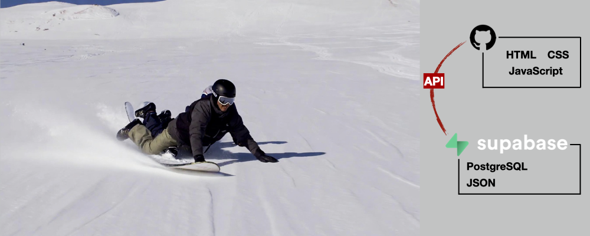
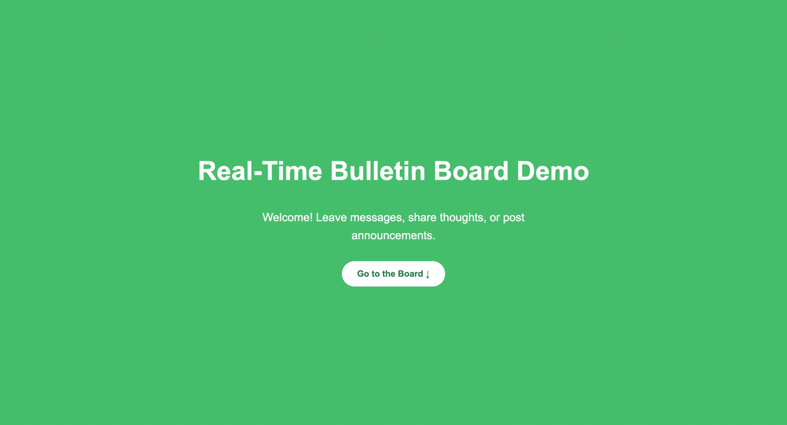
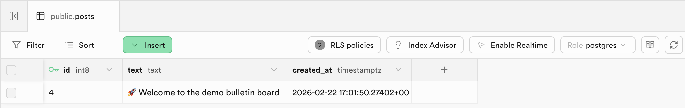
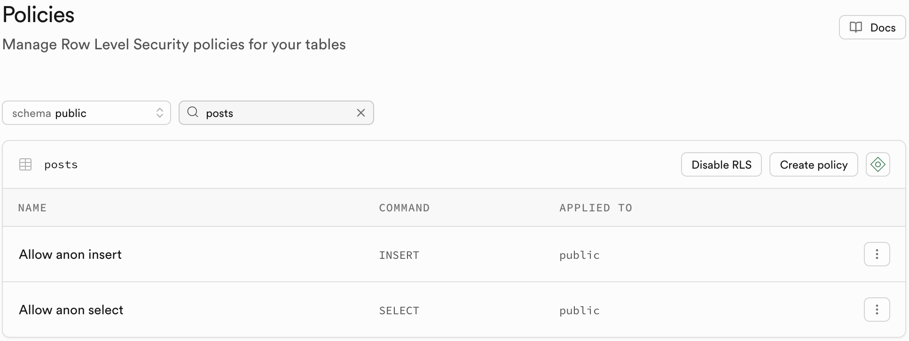
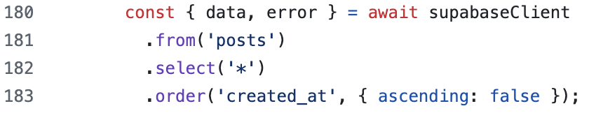
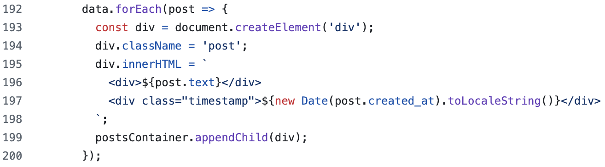

# 📌 Supabase-Powered Real-Time Bulletin Board

A lightweight real-time bulletin board built with HTML, JavaScript, and Supabase (PostgreSQL), demonstrating async API integration, JSON-based data handling, and secure row-level database access.

## 📂 Table of Contents
- [Introduction](#-introduction)
- [Project Description](#-project-description)
- [Live Demo](#-live-demo)
- [Code Snaps](#-code-snaps)
- [Summary](#-summary)

## ✍️ Introduction

This project was inspired by a young neighbor who asked me to build a website for us. What began as a simple idea evolved into a real-time community bulletin board connecting our families. The application was built using HTML, JavaScript, and Supabase (PostgreSQL), demonstrating asynchronous API integration, JSON-based data handling, and secure row-level database access.

To protect personal privacy, this repository contains a separate demo version that showcases the technical foundation and learning outcomes of the project without including any private information.

## 🧠 Project Description

This project is a lightweight, serverless real-time bulletin board built using **HTML, CSS, and vanilla JavaScript** on the front end, with **Supabase (PostgreSQL)** as the backend service. The application allows users to submit and retrieve posts that are stored in a managed PostgreSQL database.

The front end communicates with Supabase using the **Supabase JavaScript client**, performing asynchronous `insert` and `select` operations against a `posts` table. Each post includes a unique ID and an automatically generated timestamp. Data is transmitted in **JSON format** between the client and the database.

**Row-Level Security (RLS)** policies are configured to allow controlled public access for reading and inserting posts while maintaining database security. Because Supabase provides a managed backend and auto-generated API layer, the application operates without a custom server, demonstrating a **serverless architecture pattern**.

### Key Technical Highlights

- SQL table design and policy configuration  
- Asynchronous API integration in JavaScript  
- JSON-based data exchange  
- Dynamic DOM manipulation and rendering  
- Secure frontend-to-database communication

## ▶️ Live Demo

🔗 [Try Live Demo Yourself](https://realtime-bulletin-board-demo.netlify.app/)

## 📸 Code Snaps

### Database Structure

Shows the `posts` table schema in Supabase, including columns for ID, text, and timestamps. Sensitive data and API keys are excluded.

### Row-Level Security Policies

Illustrates the RLS configuration that allows public users to insert and select posts while keeping the database secure.

### Supabase Integration Code

Highlights the JavaScript client setup, including async `insert` and `select` operations for real-time communication with Supabase.

### DOM Manipulation Logic

Highlights the JavaScript client setup, including async `insert` and `select` operations for real-time communication with Supabase.

## 💡 Summary

[Highlight skills – Call out full-stack integration, database handling, and asynchronous JS logic, showing technical depth without needing a large application.]
