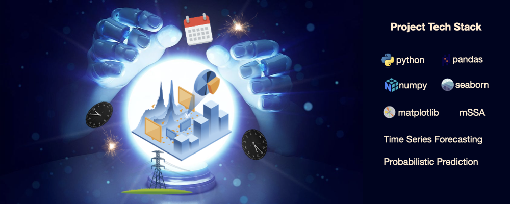

# 🔌 Electricity Load Forecasting with Probabilistic Time Series Models
A time series forecasting study applying **Multivariate Singular Spectrum Analysis (MSSA)** to predict electricity consumption across multiple smart meter clients using probabilistic forecasts and prediction intervals.



---

## 📂 Table of Contents
- [Overview](#-overview)
- [Dataset](#-dataset)
- [Problem Statement](#-problem-statement)
- [Methodology](#-methodology)
- [Results](#-results)
- [Insights & Recommendations](#-insights--recommendations)
- [Technologies Used](#-technologies-used)
- [How to Run](#-how-to-run)

---

## 🧠 Overview

This project develops a **multi-client electricity demand forecasting system** using smart meter data.

The model predicts **future electricity consumption for hundreds of households simultaneously** by extracting shared temporal patterns across multiple time series.

The study uses **Multivariate Singular Spectrum Analysis (MSSA)**, a matrix decomposition–based forecasting method that identifies:

- long-term trends
- daily and weekly seasonality
- noise components in electricity usage

The model generates **probabilistic forecasts**, producing:

- mean predictions
- lower prediction bounds
- upper prediction bounds

These forecasts are evaluated against actual consumption patterns for multiple clients.

---

## 📊 Dataset

The dataset comes from the **UCI Machine Learning Repository — Electricity Load Dataset**.

It contains electricity consumption measurements from **370 smart meter clients**.

Electricity usage is recorded every **15 minutes** over a period of **four years**.

### Variables

| Variable | Description |
|--------|-------------|
| timestamp | Date and time of the electricity measurement |
| MT_001 – MT_370 | Electricity consumption for each client (kW) |

### Dataset Characteristics

- **370 electricity clients**
- **15-minute interval measurements**
- **2011-01-01 to 2015-01-01**
- Over **140,000 time steps**

Some clients appear after 2011. For these clients, earlier consumption values are recorded as **zero**.

> **Note:** The full dataset exceeds GitHub's file size limits.  
> It can be downloaded from the **UCI Machine Learning Repository**.

---

## ❓ Problem Statement

Electricity providers must forecast future energy demand to ensure reliable power generation and grid stability.

Accurate demand forecasting enables:

- efficient electricity generation planning
- reduced operational costs
- improved grid management

Traditional forecasting methods often model **each time series independently**, which can fail to capture shared patterns across multiple consumers.

The goal of this project is to build a **multi-series forecasting model** that:

- predicts electricity consumption for multiple clients simultaneously
- captures common seasonal patterns across users
- produces **uncertainty estimates via prediction intervals**

---

## 🔎 Methodology

The forecasting workflow follows an end-to-end data science pipeline.

### 1. Data Preparation

- Loaded smart meter electricity consumption data
- Performed exploratory analysis on:
  - consumption distributions
  - daily usage patterns
  - client variability
- Handled missing values and inactive periods
- Selected representative clients for evaluation

---

### 2. Model Implementation

The project implements **Multivariate Singular Spectrum Analysis (MSSA)**.

MSSA works by:

1. Embedding multiple time series into a trajectory matrix
2. Performing **Singular Value Decomposition (SVD)**
3. Extracting dominant temporal patterns
4. Reconstructing the signal and forecasting future values

Key model parameters include:

- **rank** — number of components used for reconstruction
- **gamma** — regularization parameter
- **col_to_row_ratio**
- **window length (L)**

---

### 3. Forecast Generation

The trained model produces **future electricity demand forecasts**, including:

- mean predictions
- lower confidence bounds
- upper confidence bounds

Forecasts are generated for **multiple clients simultaneously**.

---

### 4. Model Evaluation

Model performance is assessed by comparing predicted values with **actual electricity consumption**.

Evaluation focuses on:

- trend alignment
- prediction interval coverage
- behavior during demand peaks
- forecasting stability across multiple clients

Representative forecasts are visualized for **20 different clients**.

---

## 📈 Results

The model successfully captures **daily electricity demand patterns** across most clients.

Typical forecast behavior includes:

- increasing demand during active hours
- peak electricity consumption in the evening
- decreasing demand during nighttime

Prediction intervals generally cover the **true electricity consumption values**, indicating reliable uncertainty estimation.

However, performance varies depending on the characteristics of each client.

---

## 💡 Insights & Recommendations

### Insights

- MSSA effectively captures **shared seasonal patterns** across multiple electricity consumers.
- Clients with **stable consumption patterns** produce more accurate forecasts.
- High-variance clients show **larger prediction intervals** due to increased uncertainty.
- Noisy or irregular time series (e.g., sudden zero consumption periods) reduce forecast accuracy.
- Large-consumption clients introduce higher volatility in prediction results.

### Recommendations

- Perform **data cleaning and anomaly detection** before training forecasting models.
- Tune MSSA hyperparameters such as **rank, gamma, and window length** using grid search.
- Explore **client segmentation** to build specialized models for different consumption profiles.
- Investigate **hybrid forecasting models** combining MSSA with machine learning approaches.

---

## ⚙️ Technologies Used

- **Python**
- **Pandas**
- **NumPy**
- **Matplotlib**
- **Time Series Forecasting**
- **Multivariate Singular Spectrum Analysis (MSSA)**
- **UCI Electricity Load Dataset**

---

## ▶️ How to Run

```bash
# Clone the repository
git clone https://github.com/elescj/018-electricity-lr.git
cd 018-electricity-lr

# Create virtual environment
python -m venv venv
source venv/bin/activate   # Windows: venv\Scripts\activate

# Install dependencies
pip install -r requirements.txt

# Run the project
python main.py
