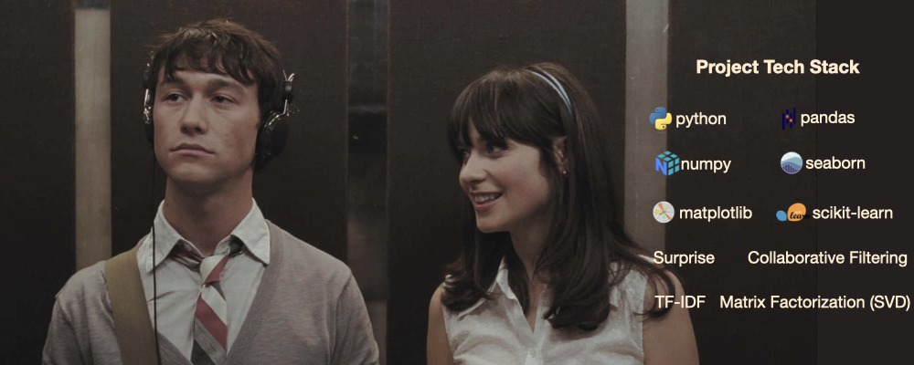

# 🎵 Music Recommendation System: Hybrid Modeling, Collaborative Filtering, and Ranking Optimization
A comprehensive study of **popularity-based methods, collaborative filtering, matrix factorization, clustering, and content-based models** to generate personalized music recommendations from large-scale user–song interaction data.



---

## 📂 Table of Contents
- [Overview](#-overview)
- [Dataset](#-dataset)
- [Problem Statement](#-problem-statement)
- [Methodology](#-methodology)
- [Results](#-results)
- [Insights & Recommendations](#-insights--recommendations)
- [Technologies Used](#-technologies-used)
- [How to Run](#-how-to-run)

---

# 🧠 Overview

Music recommendation systems are at the core of modern streaming platforms, enabling users to discover relevant content from millions of available songs.

This project builds an **end-to-end music recommendation system** using real-world user listening behavior. The system evaluates multiple recommendation approaches and integrates them into a **hybrid pipeline with ranking optimization**.

The following techniques are implemented and compared:

- **Popularity-Based Recommendation (Baseline)**
- **User–User Collaborative Filtering**
- **Item–Item Collaborative Filtering**
- **Matrix Factorization (SVD)**
- **CoClustering**
- **Content-Based Filtering (TF-IDF + Cosine Similarity)**
- **Ranking Optimization (Popularity Bias Correction)**

Models are evaluated using both **prediction accuracy** and **top-N recommendation metrics**, reflecting real-world recommendation scenarios.

---

# 📊 Dataset

This project uses the **Taste Profile Subset of the Million Song Dataset**, which contains real-world user listening behavior.

Two main datasets are used:

### User Interaction Dataset

| Variable | Description |
|--------|-------------|
| user_id | Unique identifier for each user |
| song_id | Unique identifier for each song |
| play_count | Number of times a user played a song |

---

### Song Metadata Dataset

| Variable | Description |
|--------|-------------|
| song_id | Unique song identifier |
| title | Song title |
| release | Album name |
| artist_name | Artist name |
| year | Year of release |

---

### Dataset Characteristics

- **2M+ user–song interactions**
- **~3K users**
- **~10K songs**
- Implicit feedback dataset (no explicit ratings)

Key properties:

- High **sparsity**
- Strong **popularity bias**
- Heavy-tailed interaction distribution

---

# ❓ Problem Statement

Music platforms contain **millions of songs**, making it difficult for users to discover relevant content.

The objective of this project is to build and evaluate multiple recommendation models that:

- generate personalized song recommendations
- handle implicit feedback (play counts)
- address sparsity in user–item interactions
- mitigate popularity bias
- support cold-start scenarios
- optimize ranking for user experience

---

# 🔎 Methodology

The project follows a **production-style recommendation pipeline**.

---

## 1. Data Preparation

- Merged user interaction and song metadata
- Removed duplicates and handled missing values
- Analyzed interaction distribution and sparsity
- Created **user–item interaction matrix**

---

## 2. Baseline Model (Popularity-Based)

- Ranked songs by total play counts
- Applied **popularity-adjusted scoring**
- Provided recommendations for cold-start users

---

## 3. Collaborative Filtering

Implemented using the **Surprise library**.

### User–User CF
- Finds similar users based on listening patterns
- Recommends songs liked by similar users

### Item–Item CF
- Computes similarity between songs
- More stable and scalable than user-based methods

---

## 4. Matrix Factorization (SVD)

- Decomposes user–item matrix into latent factors
- Learns hidden user preferences and song features
- Handles sparsity effectively
- Tuned using **GridSearchCV**

---

## 5. CoClustering

- Groups users and items into clusters
- Generates recommendations based on cluster-level interactions
- Provides interpretable segmentation-based recommendations

---

## 6. Content-Based Filtering

- Created text features using:
  - title + album + artist
- Applied **TF-IDF vectorization**
- Computed **cosine similarity**
- Recommended similar songs based on content

---

## 7. Ranking Optimization

- Applied **popularity bias correction**:
  
  corrected score = predicted score − 1 / √(play frequency)

- Improved:
  - recommendation diversity
  - fairness
  - exposure of long-tail items

---

## 8. Model Evaluation

### Prediction Accuracy
- **RMSE**

### Recommendation Quality
- **Precision@K**
- **Recall@K**
- **F1-score**

---

# 📈 Results

Key findings:

- **Matrix Factorization (SVD) achieved the best performance**
  - RMSE ↓ to ~0.97
  - Highest Precision and F1 score

- **Item–Item CF performed well and provided stable recommendations**

- **User–User CF showed good personalization but lower scalability**

- **CoClustering provided interpretable but less accurate results**

- **Content-based filtering handled cold-start scenarios effectively**

- **Ranking optimization improved recommendation quality and diversity**

---

# 💡 Insights & Recommendations

### Insights

- Recommendation data is highly **sparse and skewed**
- **Popularity bias strongly affects model outputs**
- Prediction accuracy ≠ ranking quality
- **Matrix factorization captures latent preferences best**
- **Content-based models complement collaborative filtering**

---

### Recommendations

- Build a **hybrid recommendation system** combining:
  - Matrix factorization (core)
  - Item-item CF (stability)
  - Content-based filtering (cold-start)

- Incorporate additional features:
  - genre
  - audio features
  - lyrics

- Optimize for **ranking metrics instead of RMSE alone**

- Implement **real-time recommendation pipelines**

- Introduce **diversity and novelty constraints**

---

# ⚙️ Technologies Used

- **Python**
- **Pandas, NumPy**
- **Scikit-learn**
- **Surprise (Recommender Systems)**
- **TF-IDF, Cosine Similarity**
- **Collaborative Filtering**
- **Matrix Factorization (SVD)**
- **Clustering (KMeans, CoClustering)**

---

# ▶️ How to Run

```bash
# Clone repository
git clone https://github.com/elescj/021-music-lr.git
cd 021-music-lr

# Create virtual environment
python -m venv venv
source venv/bin/activate   # Windows: venv\Scripts\activate

# Install dependencies
pip install -r requirements.txt

# Run notebook
jupyter notebook
