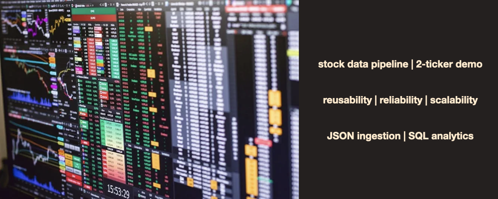

# 📈 Stock Data Pipeline: JSON Ingestion, Data Validation, and SQL Analytics
A comprehensive study of **JSON data ingestion, data validation, time-series feature engineering, and SQL-based analytics** to build a reusable pipeline for stock price analysis.



---

## 📂 Table of Contents
- [Overview](#-overview)
- [Dataset](#-dataset)
- [Problem Statement](#-problem-statement)
- [Methodology](#-methodology)
- [Results](#-results)
- [Insights & Recommendations](#-insights--recommendations)
- [Technologies Used](#technologies)
- [How to Run](#run)

---

# 🧠 Overview

Stock price data is widely used in financial analysis, trading strategies, and quantitative modeling. While candlestick charts provide intuitive visual insights, manual inspection can be inconsistent and difficult to scale.

This project builds an **end-to-end stock data pipeline** that transforms raw data into a **clean, structured, and queryable dataset**. The workflow simulates real-world data engineering processes, including ingestion, validation, feature engineering, and SQL-based analysis.

The following components are implemented:

- **JSON Data Ingestion (Simulated API Workflow)**
- **Data Validation (Schema, Missing Values, Duplicates, Sanity Checks)**
- **Time-Series Processing and Feature Engineering**
- **SQL Data Conversion and Querying**
- **Window Function Analysis (ROW_NUMBER, LAG, AVG OVER)**

The result is a **reusable pipeline** for processing multi-ticker stock data and supporting downstream analytics.

---

# 📊 Dataset

This project uses stock price data sourced from **Yahoo Finance**, converted into JSON format to simulate real-world API ingestion.

### Data Dictionary

| Variable | Description |
|--------|-------------|
| date | Trading date |
| ticker | Stock symbol (e.g., AAPL, MSFT) |
| open | Opening price |
| high | Highest price during the day |
| low | Lowest price during the day |
| close | Closing price |
| volume | Number of shares traded |

---

### Dataset Characteristics

- Multi-ticker time-series data (AAPL, MSFT)
- Daily frequency (business days)
- Structured OHLCV format
- Includes engineered features:
  - `daily_return`
  - `avg_volume_7`

---

# ❓ Problem Statement

Raw stock data is often:
- unstructured or inconsistently formatted
- prone to missing values or duplicates
- difficult to scale across multiple tickers
- not immediately suitable for analytical querying

The objective of this project is to build a data pipeline that:

- ingests and standardizes stock data from JSON format
- validates data quality and consistency
- engineers time-series features for analysis
- converts data into a SQL-ready format
- enables efficient querying using SQL and window functions

---

# 🔎 Methodology

The project follows a **data engineering pipeline design**.

---

## 1. JSON Data Ingestion

- Retrieved stock data using `yfinance`
- Converted DataFrame to JSON format
- Simulated API-style ingestion workflow
- Loaded JSON data into pandas DataFrame

---

## 2. Data Validation

Performed comprehensive validation checks:

- **Schema Validation**
- **Missing Value Detection**
- **Duplicate Detection (ticker-date level)**
- **Data Sanity Checks**
  - negative prices
  - invalid volume
  - price hierarchy violations
- **Date Validation and Standardization**
- **Time-Series Gap Detection (business days)**
- **Categorical Validation (ticker values)**

---

## 3. Feature Engineering

- Calculated **daily returns**
- Computed **7-day rolling average volume**
- Identified:
  - price outliers
  - volume spikes
- Ensured proper time-series ordering

---

## 4. SQL Data Conversion

- Stored cleaned dataset in SQLite database
- Created table `prices`
- Verified successful data load

---

## 5. SQL Analysis

### Aggregation
- Average trading volume by ticker

### Ranking
- Highest-volume trading days
- Top return days per ticker

### Window Functions
- `ROW_NUMBER()` for ranking within ticker
- `LAG()` for previous price comparison
- `AVG() OVER()` for contextual metrics

### Anomaly Detection
- Identified higher-than-usual volume days

---

# 📈 Results

Key findings:

- **AAPL shows higher average trading volume** than MSFT
- **MSFT exhibits more extreme single-day volume spikes**
- **Top return days reveal stronger upside volatility in MSFT**
- **Time-series gaps correspond to market holidays, not data issues**
- No major data quality issues were detected after validation

---

# 💡 Insights & Recommendations

### Insights

- Stock data requires **rigorous validation before analysis**
- Time-series gaps are often **calendar-driven**, not errors
- Volume and return patterns vary significantly by ticker
- SQL window functions are powerful for **time-series comparison**

---

### Recommendations

- Extend pipeline to more tickers and longer time horizons
- Incorporate additional features:
  - volatility
  - moving averages
  - technical indicators
- Integrate real-time data ingestion APIs
- Build visualization layer (e.g., candlestick charts)
- Develop predictive or pattern-recognition models

---

<a id="technologies"></a>
# ⚙️ Technologies Used

- **Python**
- **Pandas, NumPy**
- **SQL (SQLite)**
- **JSON Data Processing**
- **Time-Series Analysis**
- **Data Validation Techniques**
- **Jupyter Notebook**

---

<a id="run"></a>
# ▶️ How to Run

```bash
# Clone repository
git clone https://github.com/your-repo/022-stock.git
cd 022-stock

# Create virtual environment
python -m venv venv
source venv/bin/activate   # Windows: venv\Scripts\activate

# Install dependencies
pip install -r requirements.txt

# Run notebook
jupyter notebook
